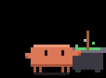

# CYD Claude Buddy

<p align="center">
  
  
  
  
  
</p>
<p align="center"><sub>Clawd hard at work — typing&nbsp;·&nbsp;hammering&nbsp;·&nbsp;brewing&nbsp;·&nbsp;painting&nbsp;·&nbsp;conjuring</sub></p>

A desk companion for Claude Code: the orange **Clawd** mascot on a **Cheap
Yellow Display** (ESP32) that mirrors your live Claude Code activity and usage
stats. It's driven entirely by Claude Code **hooks** and reaches the device
over whichever link you have — the **USB cable**, **Bluetooth LE**, or your
**WiFi** — with no always-on PC process (a tiny bridge is spawned on demand and
exits by itself when Claude goes quiet).

Clawd reacts to what Claude is doing (sleeping / ready / working, plus little
reactions when Claude needs you, finishes, or a session starts) while a stats
card tracks your usage: tokens today and all-time, tool calls, sessions, turns,
and the current session's duration.

Built for the **CYD** — the cheapest all-in-one ESP32 + screen + touch board.
The app sits on a thin HAL over `TFT_eSPI`, so it can be adapted to other
ESP32 + TFT panels — see [Adapting to other boards](#adapting-to-other-boards).

> The official "Hardware Buddy" Bluetooth feature isn't exposed in the Claude
> desktop app build used here, so this project reproduces the experience with
> a self-hosted transport: a small bridge on the PC and Claude Code hooks.
>
> _Unofficial, personal fan project — **not affiliated with or endorsed by
> Anthropic.** "Clawd" is Anthropic's character; see [License &
> credits](#license--credits)._

---

## Contents

- [How it works](#how-it-works) · [Connections: USB, BLE, WiFi](#connections-usb-ble-wifi)
- [What it shows](#what-it-shows)
- [Hardware](#hardware) · [Adapting to other boards](#adapting-to-other-boards)
- [Build &amp; flash](#build--flash)
- [First-time setup](#first-time-setup)
- [Use it from another computer](#use-it-from-another-computer)
- [On-device controls](#on-device-controls)
- [How usage is counted](#how-usage-is-counted)
- [Power use](#power-use)
- [Troubleshooting](#troubleshooting)
- [Development](#development) · [Repository layout](#repository-layout) · [License &amp; credits](#license--credits)

## How it works

```
Claude Code (PC) ──hook──▶ buddy_hook.py ──HTTP (localhost)──▶ buddy_bridge.py
  SessionStart / UserPromptSubmit / PreToolUse /                    │ USB serial
  PostToolUse / Stop / SessionEnd / Notification                    │ or BLE GATT
                                                                     │ or WiFi (TCP)
                                                                     ▼
                                                        device (Clawd + dashboard)
```

- **Hook (`tools/buddy_hook.py`).** A self-contained Python script Claude Code
  runs on each hook event (~0.1 s, stdlib only). It works out what Claude is
  doing, reads the session transcript for the usage rollup, and `POST`s a
  snapshot to the local bridge. Status events are **async and fail open**: if
  the bridge or device is unreachable the error is swallowed, so they never
  slow down or break a session.
- **Bridge (`tools/buddy_bridge.py`).** A small Python process on
  `127.0.0.1:8787` that relays the hook's calls to the device over the first
  link that works (see [Connections](#connections-usb-ble-wifi)). It is **not**
  a daemon: the hook spawns it on demand (connection refused → spawn), and it
  **exits by itself after 10 minutes without events** — no autostart entry,
  no standing drain.
- **Device (firmware).** Every link carries the same messages: JSON envelopes
  `{"k":"event"|"ask"|…,"tok":…,"d":{…}}` in, `{"t":"decision"|"info",…}` out.
  One hub on the device checks the token and applies them, whichever link they
  came from. It renders the Clawd GIF pack from on-board flash (LittleFS).
  By default it's purely a display; an **optional** opt-in adds on-device
  *tap-to-approve* for a pending tool call (see [tools/HOOKS.md](tools/HOOKS.md)).

The device is the source of truth for its own auth token; the PC just needs a
copy of it (see [setup](#first-time-setup)) — no pairing, no bonding.

## Connections: USB, BLE, WiFi

| Link | Use it when | PC needs | Notes |
|---|---|---|---|
| **USB** | the buddy is plugged into this PC anyway (it's also its power) | `pip install pyserial` | the flashing/log port; zero radio, zero setup |
| **BLE** | the buddy sits on the desk on its own power | `pip install bleak`, a Bluetooth adapter | ~10 m range; the default "wireless" choice |
| **WiFi** | out of Bluetooth range, or several PCs share one buddy | nothing extra | **opt-in**: set up once over USB; costs ~50 mA more on battery |

The bridge tries them in order **USB → BLE → WiFi** and uses the first that
answers (it re-picks whenever the link drops). To pin or reorder, set
`"transport"` in `~/.claude/buddy.json`: `"usb"`, `"ble"`, `"wifi"`, or a list
such as `["usb", "wifi"]`. Check what it's using with:

```bash
python tools/buddy_bridge.py status
```

**Setting up WiFi** — plug the buddy in by USB and run (the password never
travels over Bluetooth, which is unencrypted; the device only accepts WiFi
credentials over the cable):

```bash
python tools/buddy_bridge.py wifi "<ssid>" "<password>"
```

It prints the address it got (the device's **Settings** screen shows it too),
and the bridge remembers it. From then on the bridge falls back to WiFi when
neither the cable nor BLE reaches — it finds the buddy at its last address or
as `claude-cyd.local` (mDNS). Pin an address with `"device": "<ip>"` in
`buddy.json`. `python tools/buddy_bridge.py wifi --off` turns WiFi off and
forgets the network. On the LAN, envelopes (with the token) travel in plain
TCP on port 8788 — fine for a home network, not for an untrusted one.

## What it shows

**Character states** (the mascot in the middle):

| State | When | Look |
|---|---|---|
| `sleep` (ASLEEP) | no bridge attached (Claude not in use), or no activity yet | flattened, eyes shut, drifting Z's |
| `idle` (READY) | connected, no work running | breathing, blinking, looking around, the odd happy hop |
| WORKING | Claude is working | a clip for what it's doing (below) + a matching verb in the card |
| `attention` (NEEDS YOU) | the turn was handed back to you — a **Notification**, or **Stop** with nothing to do next | waves at you under a "!" bubble; sticky, and the LED nudge escalates the longer it waits |
| `celebrate` (DONE!) | a turn just finished (**Stop**) | jumps for joy in confetti |
| `heart` (HELLO) | a new session started (**SessionStart**), or you pet Clawd (tap the character) | blushes, hearts float up |
| `error` (OOPS) | a tool reported an error | winces, sweat drop |
| `dizzy` | triple-tap the screen | X eyes, stars circling its head |

**While working, Clawd acts out the tool Claude is using:**

| Claude is… | Tools | Clawd is… | Verb |
|---|---|---|---|
| editing | Edit, Write, MultiEdit, NotebookEdit | tapping away at the keyboard under its monitor, or writing in a notepad | Editing… |
| running | Bash (+ output / kill) | watching a terminal fill, or hammering a nail in a hard hat | Running… |
| reading | Read, Grep, Glob, LS | reading a book, or sweeping a magnifier down a page | Reading… |
| searching | WebSearch, WebFetch | studying a spinning globe | Searching… |
| planning | TodoWrite, ExitPlanMode | ticking off a clipboard | Planning… |
| using tools | any MCP server tool (`mcp__…`) | plugging a cable in | Using tools… |
| delegating | Task (subagents) | sending little helpers off, or juggling | Delegating… |
| thinking | a prompt was just sent | pondering under a thought cloud | Thinking… |
| compacting | PreCompact (optional hook) | sweeping up | Compacting… |
| anything else | — | a carousel: brewing, forging, conjuring, pondering, juggling, painting, cranking gears, stacking blocks on its head, vibing — with a whimsical verb ("Brewing…", "Conjuring…") in sync | Brewing… etc. |

Each new tool event nudges Clawd to another clip of the same activity, so the
animation keeps pace with Claude.

`celebrate` / `heart` / `error` are short reactions that play for a few seconds
(and wake the screen if it's off), then fall back to the normal state.
`attention` ("Needs you") is sticky until Claude resumes — or until you dismiss
it on the device. While it waits, the screen drops the stats card for a clean
alert (just the amber Clawd and a **Got it** button); tapping **Got it** drops
the device straight back to idle (LED off) until the next time Claude needs you.
Dismissing is local — it doesn't reply to Claude.

**Stats card** (bottom): two headline figures — **Today** and **Total** tokens —
over four compact counts: **Tools** (tool calls), **Turns** (assistant turns),
**Sess** (sessions today), **Time** (current session duration). The numbers
roll like an odometer when they change. **Swipe left** and the **Trends card**
slides in: a bar per day for the last 14 days (today in coral, still growing
live) with a 7-day total and daily average — the device keeps a 30-day history
in flash, dated by the PC so it needs no clock of its own. **Swipe right** to
slide back; swiping past the end rubber-bands. A fuller, live-updating panel is
under long-press → **Settings → Stats** (adds a rough cost estimate, project
name, battery estimate, uptime, free heap, and which link is live).

**Ambient cues.** The onboard RGB LED speaks a colour language — a slow blue
breath while working (cooler/quicker as the session heats up), a gentle amber
breath when it needs you (escalating to hard blinks the longer it waits), red
on error, green when a turn lands, and a little magenta heartbeat while you pet
Clawd — silenced by the **Quiet** (Do Not Disturb) setting, and off whenever
the screen is asleep. The top bar shows session intensity as 1–2 pips, a link
dot (green while a bridge is attached), and a small **battery glyph** — an
estimate for the battery setup below; ignore it on wall power. Set an optional
daily token `"budget"` in `buddy.json` and the stats-card divider becomes a
usage gauge (coral → amber near the cap → red over).

## Hardware

**Reference board — ESP32-2432S028R "Cheap Yellow Display" (CYD):**

- ESP32-WROOM-32, 4 MB flash, no PSRAM.
- Display: **ILI9341** 240×320 — the dual-USB "CYD2USB" unit is ILI9341, *not*
  ST7789 (feeding it the ST7789 driver gives a white screen).
- Resistive touch (XPT2046), onboard RGB LED, light sensor (GPIO34), the BOOT
  key doubling as a runtime button, CH340 USB-serial.

It's the cheapest all-in-one board with a screen + touch (≈US$10), which is why
it's the default — but nothing about the app is CYD-specific.

### Power: wired or battery

The board wants **5 V**, over its micro-USB port or the `P1` header's VIN/GND
pins. Two ways to feed it:

- **Wired (simplest).** Any USB power source. Plugged into the PC running
  Claude Code, the same cable is also the **USB link**. The battery glyph and
  the Stats panel's **Battery (est)** row assume the battery setup below; on
  wall power just ignore them.
- **Battery.** Reference setup: a **2000 mAh Li-ion cell + a cheap
  charge/discharge boost module** (the "charge + 5 V boost in one board" kind).
  The cell plugs into the module; the module's 5 V output feeds the CYD (its
  USB-A output into the CYD's micro-USB cable, or OUT+/OUT− wired to `P1`
  VIN/GND). No electrical changes to the CYD itself. Notes from the field:
  - **Charge the module's input port**, not the CYD's USB. Cheap modules'
    USB-C input usually lacks the CC handshake resistors, so a **USB-C PD
    charger with a C-to-C cable delivers nothing** (no LED, no charge) — use a
    USB-A charger / power-bank A-port with an A-to-C (or A-to-micro) cable.
  - **Charge with the buddy powered off** (Settings → Power off) if you want
    the module's "full" LED to be truthful — the running device's draw keeps
    cheap chargers from ever terminating.
  - The firmware ships a **software battery gauge** for exactly this setup:
    the device has no data path to the cell, so it estimates charge from its
    own consumption model (see `docs/battery-gauge-spec.md`). Top-bar glyph
    (amber &lt;20%, red &lt;10%) and a **Battery (est)** row in Settings →
    Stats. It's **fully automatic and death-anchored**: run the device until
    the cell actually dies (the module's protection board guards the cell;
    stats checkpoint every minute near the end), charge it, power it on — the
    gauge learns the cell's real capacity from each death and refills to 100%
    on the first boot after one. Mid-cycle top-ups are invisible to it, so
    the reading runs low until the next full die-charge-boot cycle — it's an
    estimate, treat it as one.

### Adapting to other boards

The firmware is a thin HAL (`src/hal/`: display, touch, led, storage) over
`TFT_eSPI`, and everything above it — the links, hooks, stats, the GIF
character system — is hardware-independent. To run it on another ESP32 + TFT:

- **Display:** set the matching `*_DRIVER` flag and pins in `platformio.ini`
  (`TFT_eSPI` supports ILI9341 / ST7789 / ST7735 / ILI9488 / …). The character
  region and UI lay themselves out from `display.width()/height()`.
- **Touch (optional):** adjust the XPT2046 pins in `src/hal/touch.cpp`, or stub
  `hal::Touch` — touch only drives the Settings menu and the easter egg.
- **LED (optional):** `src/hal/led.cpp`; safe to no-op if your board has none.
- **USB link:** any USB-serial chip works; the bridge probes CH340, CP210x,
  FTDI and native Espressif USB ports (or name one with `"serial": "COM7"`).
- **Flash / partition:** the Clawd pack needs ~1.2 MB of LittleFS — size the
  data partition to your board's flash (drop some `busy_*` clips from the pack
  and manifest if you're tight).

The Clawd art is a plain GIF pack (`data/clawd/` + `manifest.json` mapping
states to clips), drawn entirely in code by `tools/art/clawd_gen.py`. Clawd
keeps its original design in every clip — the flat orange block, big black
eyes, block arms and four legs — and only its actions and props change. The
clips are 190×140 (the device's character box, so they render 1:1; ~1 MB for
the whole pack). Tweak the generator and re-run it
(`python tools/art/clawd_gen.py --sheet sheet.png` also writes a contact sheet
to review), or drop in your own character — any size; the renderer fits it to
its 190×140 box. `tools/test_art_pack.py` checks that every state the firmware
and hook use has clips.

## Build & flash

You need [PlatformIO](https://platformio.org/) (the `pio` CLI, or the VS Code
extension) and a USB cable to the board.

```bash
pio run -e cyd -t upload      # 1) firmware  -> app partition
pio run -e cyd -t uploadfs    # 2) GIF pack  -> LittleFS (data/clawd/)
```

Run both the first time (firmware *and* the filesystem image). After that,
re-flash only what changed — `upload` for code, `uploadfs` for new/edited GIFs.
If a bridge is holding the USB port, `python tools/buddy_bridge.py stop` frees
it first.

> **Upgrading an older build:** the partition layout keeps **nvs and LittleFS
> at their exact offsets**, so an `upload` keeps the token, touch + battery
> calibration and stats history. Run `uploadfs` too whenever `data/clawd/`
> changed — e.g. the redrawn character pack (new clip names: the new firmware
> won't find the old files). Updates are USB-only — there's no over-the-air
> flash.

The display driver is a build flag (`ILI9341_2_DRIVER` in `platformio.ini`); on a
different panel that shows a white or garbled image, switch to your controller's
driver/colour-order flags (e.g. `ST7789_DRIVER` + `TFT_RGB_ORDER=TFT_BGR`).

> **First build on a slow/blocked network.** The initial espressif32 toolchain +
> framework download can stall. If it does, fetch those archives out-of-band
> (e.g. a parallel, resumable downloader) and point PlatformIO at them with
> `platform_packages = …@file://…` in `platformio.ini`.

## First-time setup

1. **Flash** firmware + filesystem (above). The device boots straight to the
   dashboard, listening on USB and advertising over BLE — nothing to provision.
2. **Read its token:** long-press → **Settings** — it's the bottom line. (It's
   also printed on the serial console at boot as `[hub] token=…`, e.g. in
   `pio device monitor`.) The token is a random secret generated on the device.
3. **Install Python 3** (on `PATH`) plus the library for your link:
   `python -m pip install pyserial` for USB, `python -m pip install bleak` for
   BLE (both is fine; WiFi needs neither).
4. **Tell your PC the secret** — `~/.claude/buddy.json`:
   ```json
   { "token": "<device token>" }
   ```
   Optional keys: `"transport"` (see [Connections](#connections-usb-ble-wifi)),
   `"port"` (move the bridge off `8787`), `"budget"` (the on-device daily token
   gauge), `"device"` (the buddy's WiFi address), `"serial"` (a fixed COM port).
5. **Register the hooks** in `~/.claude/settings.json` so Claude Code drives the
   device. Full snippet + explanation: **[tools/HOOKS.md](tools/HOOKS.md)**.

That's it — start a Claude Code session: the first hook event spawns the
bridge, the bridge finds the buddy, and Clawd wakes up.

## Use it from another computer

**The flashed device is fully standalone** — firmware and the animation pack
live in its own flash; it needs no PC, no repo and no cloud. To drive it from
another machine, repeat the setup there: copy `tools/buddy_hook.py` **and**
`tools/buddy_bridge.py` side by side (e.g. into `~/.claude/` — the hook starts
the bridge from its own folder), install the library for your link, create
`buddy.json` with the token, register the hooks.

- **Same LAN, WiFi set up:** that machine's bridge reaches the buddy over WiFi
  as `claude-cyd.local` — or add `"device": "<address>"` (shown on the
  device's Settings screen) if mDNS doesn't resolve there. `"transport":
  "wifi"` skips the USB/BLE attempts; no pyserial/bleak needed.
- **No link of its own** (a remote box you SSH into, a VM): run the bridge on
  the PC next to the buddy with `python buddy_bridge.py --listen 0.0.0.0`, and
  point the remote machine's `buddy.json` at it with
  `"host": "<pc-address>:8787"` (reachable over LAN or a mesh VPN such as
  Tailscale). The remote machine only needs `buddy_hook.py`.

Each machine keeps its **own** counts (`buddy_tokens.json` is per-machine, not
merged); if two machines push at once, the device shows whichever pushed last.

## On-device controls

- **Tap** while asleep — wake the screen.
- **Tap Clawd** — pet the character: a brief `heart` hello.
- **Swipe left / right** — slide the bottom card between **stats** (left page)
  and **trends** (right page); swiping past the end rubber-bands. Returns to
  stats when the screen next sleeps.
- **Tap "Got it"** on the *Needs you* screen — dismiss the nudge: the device
  drops back to idle (LED off) until the next time Claude needs you.
- **Triple-tap** — `dizzy` easter egg.
- **BOOT key** (the physical button next to RST) — short press wakes the screen
  or taps **Got it** for you; holding it toggles **Quiet** (one red blink = on,
  green = off). Handy when tapping the resistive panel is inconvenient.
- **Long-press (~0.7 s)** — open **Settings**: **Power off** (top row, in red —
  deep sleep: screen, LED and radios off; tap the screen or press the board's
  **RST** button to turn it back on), **Stats** (full live panel),
  **Quiet** (on/off Do Not Disturb — silences the RGB LED and stops the screen
  auto-waking for nudges; only your touch wakes it), **Brightness** (cycle the
  backlight 100 / 70 / 40 % / **auto** — auto night-dims to 25% when the onboard
  light sensor says the room went dark, and eases back up when the lights come
  on), **Recalibrate** (3-point touch calibration; times out safely
  if you walk away), **Close**. Below the buttons: the WiFi state/address and
  the pairing token. Quiet and brightness persist across reboots.
- Auto **screen-off after 30 s** of calm — or **3 min while Claude is working**,
  so long grinds go dark too; a touch, a fresh turn starting, or a nudge wakes
  it. After **an hour** with no touch and no Claude activity at all the device
  deep-sleeps itself (tap to wake).

## How usage is counted

`buddy_hook.py` reads the current session's transcript and rolls up the day:

- **Tokens** = `input + output + cache_creation`. It deliberately **excludes
  `cache_read`** — that's the cached context re-read on *every* turn, which on a
  long session is ~95%+ of the raw token throughput and would balloon "today" to
  absurd numbers without reflecting real use.
- Assistant messages are **de-duplicated by id** (the transcript re-logs a
  message several times as it streams), so tokens / turns / tool-calls aren't
  double-counted.
- The scan is **incremental**: each event resumes from a per-session byte
  offset (kept in `buddy_tokens.json`) and parses only what was appended, so
  hooks stay fast even when a long session's transcript reaches tens of MB.
- **Today** counts persist in `~/.claude/buddy_tokens.json` and reset at local
  midnight; the previous day rolls into the **all-time** total. A session that
  runs past midnight — or sits idle for a few days and then resumes — counts
  only its new work toward *today* and is never added to the all-time total
  twice.

## Power use

Ordered by how much they save (all automatic):

- **Auto screen-off.** The backlight is by far the largest draw. 30 s idle when
  calm; **3 min while Claude is working** (so a marathon turn goes dark instead
  of burning the backlight for an hour — LED events and any fresh turn still
  relight it). While off, the CPU drops 240 → **80 MHz** and the idle loop
  throttles to ~25 Hz; both jump back on wake.
- **Auto deep sleep.** After **1 hour** with no touch *and* no hook events the
  device powers itself fully off — radios off and the display controller put
  to sleep too; on the battery setup that's ~10 mA (including the boost
  module's idle draw) instead of idling dark. Tap the screen to wake. No link
  can wake a deep-sleeping board, which is why the leash is a full hour: any
  Claude activity inside it still lights the screen the moment work starts.
- **Pick the cheap link.** USB costs no radio at all; a connected BLE
  peripheral idles far below WiFi (~90 mA base vs ~143 mA measured on the
  WiFi build, before the screen). That's why WiFi stays **off** until you set
  it up — and `wifi --off` turns it back off.

For a manual off, **Settings → Power off** deep-sleeps the same way. On
battery the device deliberately runs until the cell's protection cuts power —
that brownout is what calibrates the gauge — checkpointing stats every minute
once the estimate reads ≤3%. Either way a screen tap or the **RST** button
cold-boots straight back into the dashboard.

## Troubleshooting

- **White / garbled screen** — wrong display driver. The CYD2USB unit is
  **ILI9341**, not ST7789; check the `*_DRIVER` flag in `platformio.ini`.
- **Buddy stays asleep / link dot dark** — is a Claude session actually
  running? The bridge only lives while hook events flow (it exits ~10 min after
  the last one) and the buddy naps whenever no bridge is attached. Run any
  Claude turn and watch it wake, then `python tools/buddy_bridge.py status`
  (or `curl --noproxy "*" http://127.0.0.1:8787/`) to see which link it uses.
- **Never connects over USB** — install `pyserial`; close any serial monitor
  holding the port; if the board isn't a CH340/CP210x/FTDI/Espressif one, name
  its port with `"serial": "COM7"` (or `/dev/ttyUSB0`).
- **Never connects over BLE** — the Windows Bluetooth stack sometimes wedges
  after sleep/resume: toggle Bluetooth off/on (or restart the "Bluetooth
  Support Service"), then run any Claude turn to respawn the bridge. Also check
  `python -m pip show bleak` and that the device is within ~10 m.
- **Never connects over WiFi** — Settings on the device shows `WiFi:
  connecting...` while it can't join (wrong password, out of range, 5 GHz-only
  network — the ESP32 needs 2.4 GHz); re-run `wifi "<ssid>" "<password>"` over
  USB. If `claude-cyd.local` doesn't resolve on your PC, set `"device"` to the
  address shown on the device.
- **Upload fails: port busy** — a bridge on the USB link holds the COM port:
  `python tools/buddy_bridge.py stop`, then flash. (While Claude Code keeps
  running, the next hook event starts a new bridge — pin `"transport": "ble"`
  while you're flashing repeatedly.)
- **Numbers never update while connected** — check `buddy.json` (the token
  must match the bottom line of the device's Settings screen), that the hooks
  are registered, and that Python 3 is on `PATH`. Envelopes with a wrong token
  are dropped silently by design.
- **Charging does nothing (battery setup)** — don't use a USB-C PD charger
  with a C-to-C cable on a cheap charge module (no CC resistors → no power);
  use a USB-A source. And charge the module's input, not the CYD's USB.
- **Battery reading looks wrong** — normal after mid-cycle top-ups (charging
  is invisible to the gauge). It re-syncs itself on the next full
  die → charge → power-on cycle.

## Development

```bash
cd tools && python -m unittest -v test_buddy_hook test_buddy_bridge test_art_pack
```

The Python tests need no hardware: the hook's rollup runs on temp files, the
bridge's USB and WiFi transports run end to end against a fake device on a
loopback socket (the USB path through pyserial's `socket://` URL), and the art
pack is checked against the states the firmware and hook use (needs Pillow).
CI (`.github/workflows/ci.yml`) runs them and builds the firmware on every
push; it never uploads. Firmware changes still want a check on a real board.

## Repository layout

```
src/            firmware: main.cpp (orchestrator), net/ (envelope hub + the
                USB, BLE and WiFi transports), app/ (state tables, LED
                language, NVS store, power, battery gauge), ui/ (theme, text,
                widgets), screens/ (home, trends, card slide, stats, settings,
                ask), hal/ (display, touch, led, storage), render/ (Clawd GIF)
data/clawd/     Clawd GIF character pack (flashed as the LittleFS image)
assets/         README preview GIFs
tools/          buddy_hook.py + buddy_bridge.py (PC side), their tests, and
                HOOKS.md (hook setup); art/clawd_gen.py draws the GIF pack
docs/           design notes
.github/        CI: Python tests + firmware build
platformio.ini  build configuration (partitions.csv: flash layout)
```

## License & credits

- **Code & tooling** (firmware + `tools/`): **MIT** — see
  [LICENSE](LICENSE). © 2026 Qiankang (Kant) Wang.
- **Clawd character art** (`data/clawd/` and `assets/`): **not MIT.** "Clawd" is
  the property of **Anthropic, PBC**; all rights reserved. The sprites are this
  project's own drawing of the character, generated by `tools/art/clawd_gen.py`
  (earlier releases used sprites adapted from
  [rullerzhou-afk/clawd-on-desk](https://github.com/rullerzhou-afk/clawd-on-desk)).
  Swap in your own GIF pack to redistribute the project freely.
- **Concept & event model:** inspired by Anthropic's maker reference
  [claude-desktop-buddy](https://github.com/anthropics/claude-desktop-buddy)
  (MIT), reproduced here over Claude Code hooks with a self-hosted bridge.
- **CYD pinouts & community:** [witnessmenow/ESP32-Cheap-Yellow-Display](https://github.com/witnessmenow/ESP32-Cheap-Yellow-Display) (MIT).

> **Disclaimer.** This is an unofficial, personal fan project. It is **not
> affiliated with, sponsored by, or endorsed by Anthropic.** "Claude" and
> "Clawd" are trademarks/IP of Anthropic, PBC, used here only to interoperate
> with Claude Code for a non-commercial maker build.
