# CYD Claude Buddy

<p align="center">
  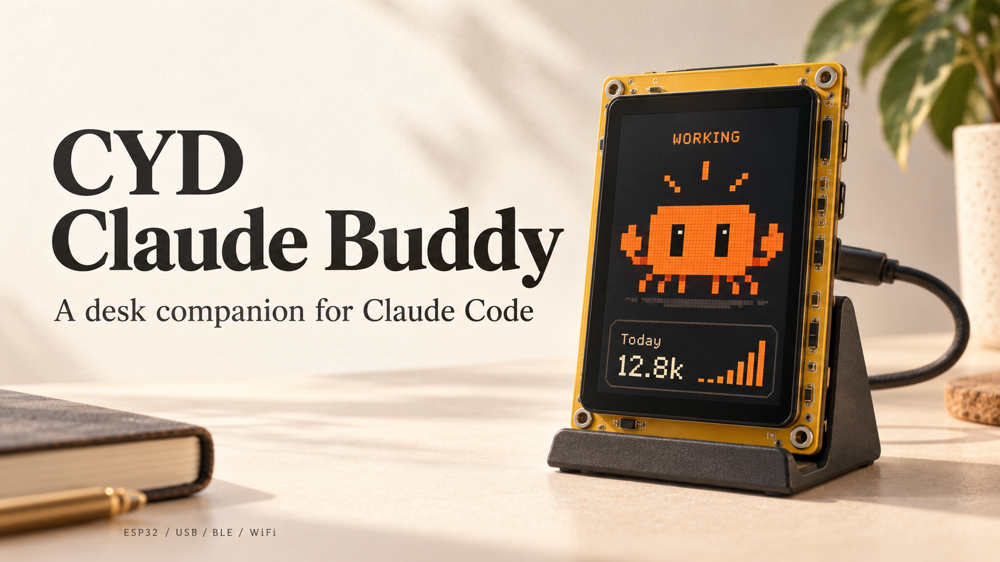
</p>

A tiny desk companion for **Claude Code**, built on the **ESP32 Cheap Yellow Display**.
Clawd acts out your coding activity, tracks usage, and nudges you when Claude needs you.

- **Live animations** for editing, running commands, reading, thinking, and more.
- **Usage at a glance:** tokens, tool calls, turns, sessions, and daily trends.
- **USB, Bluetooth LE, or WiFi**, with a bridge that starts and stops on demand.

[Animations](#clawd-in-action) · [Quick start](#quick-start) · [User guide](docs/GUIDE.md) · [Hook setup](tools/HOOKS.md)

## Clawd in action


All **29 animations**, as shown on the device. Click a preview to open the GIF.

### Working

<table>
  <tr>
    <td align="center" width="33%"><a href="data/clawd/typing.gif"></a><br> <strong>Typing</strong></td>
    <td align="center" width="33%"><a href="data/clawd/writing.gif">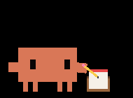</a><br> <strong>Writing</strong></td>
    <td align="center" width="33%"><a href="data/clawd/terminal.gif">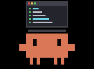</a><br> <strong>Running commands</strong></td>
  </tr>
  <tr>
    <td align="center" width="33%"><a href="data/clawd/hammering.gif"></a><br> <strong>Building</strong></td>
    <td align="center" width="33%"><a href="data/clawd/reading.gif">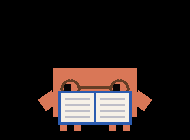</a><br> <strong>Reading</strong></td>
    <td align="center" width="33%"><a href="data/clawd/scanning.gif">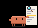</a><br> <strong>Inspecting</strong></td>
  </tr>
  <tr>
    <td align="center" width="33%"><a href="data/clawd/searching.gif">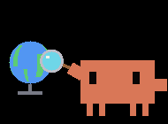</a><br> <strong>Searching</strong></td>
    <td align="center" width="33%"><a href="data/clawd/planning.gif">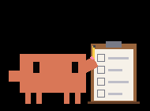</a><br> <strong>Planning</strong></td>
    <td align="center" width="33%"><a href="data/clawd/tooling.gif">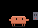</a><br> <strong>Using tools</strong></td>
  </tr>
  <tr>
    <td align="center" width="33%"><a href="data/clawd/delegating.gif">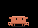</a><br> <strong>Delegating</strong></td>
    <td align="center" width="33%"><a href="data/clawd/pondering.gif">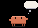</a><br> <strong>Thinking</strong></td>
    <td align="center" width="33%"><a href="data/clawd/sweeping.gif">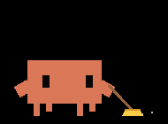</a><br> <strong>Compacting</strong></td>
  </tr>
</table>

### Creative

<table>
  <tr>
    <td align="center" width="33%"><a href="data/clawd/brewing.gif">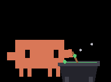</a><br> <strong>Brewing</strong></td>
    <td align="center" width="33%"><a href="data/clawd/forging.gif">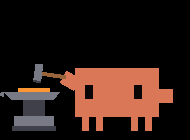</a><br> <strong>Forging</strong></td>
    <td align="center" width="33%"><a href="data/clawd/conjuring.gif"></a><br> <strong>Conjuring</strong></td>
  </tr>
  <tr>
    <td align="center" width="33%"><a href="data/clawd/juggling.gif">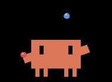</a><br> <strong>Juggling</strong></td>
    <td align="center" width="33%"><a href="data/clawd/painting.gif"></a><br> <strong>Painting</strong></td>
    <td align="center" width="33%"><a href="data/clawd/churning.gif">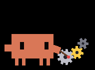</a><br> <strong>Turning gears</strong></td>
  </tr>
  <tr>
    <td align="center" width="33%"><a href="data/clawd/stacking.gif">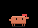</a><br> <strong>Stacking blocks</strong></td>
    <td align="center" width="33%"><a href="data/clawd/vibing.gif">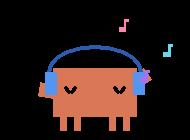</a><br> <strong>Vibing</strong></td>
    <td></td>
  </tr>
</table>

### Rest & reactions

<table>
  <tr>
    <td align="center" width="33%"><a href="data/clawd/sleep.gif">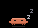</a><br> <strong>Sleeping</strong></td>
    <td align="center" width="33%"><a href="data/clawd/idle_blink.gif">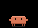</a><br> <strong>Blinking</strong></td>
    <td align="center" width="33%"><a href="data/clawd/idle_look.gif">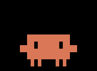</a><br> <strong>Looking around</strong></td>
  </tr>
  <tr>
    <td align="center" width="33%"><a href="data/clawd/idle_hop.gif"></a><br> <strong>Happy hop</strong></td>
    <td align="center" width="33%"><a href="data/clawd/attention.gif">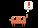</a><br> <strong>Needs you</strong></td>
    <td align="center" width="33%"><a href="data/clawd/celebrate.gif">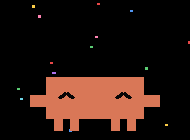</a><br> <strong>Done!</strong></td>
  </tr>
  <tr>
    <td align="center" width="33%"><a href="data/clawd/heart.gif">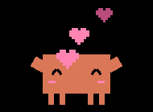</a><br> <strong>Hello</strong></td>
    <td align="center" width="33%"><a href="data/clawd/error.gif">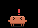</a><br> <strong>Oops</strong></td>
    <td align="center" width="33%"><a href="data/clawd/dizzy.gif">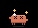</a><br> <strong>Dizzy</strong></td>
  </tr>
</table>

## Quick start

You need an **ESP32-2432S028R (CYD)**, a USB cable, **Python 3**, and
[PlatformIO](https://platformio.org/). The reference board uses an **ILI9341** display.

**1. Clone and flash** both firmware and animations:

```bash
git clone https://github.com/wangkant/claude-buddy-cyd.git
cd claude-buddy-cyd
pio run -e cyd -t upload
pio run -e cyd -t uploadfs
python -m pip install pyserial bleak
```

**2. Configure the device token.** Long-press the screen → **Settings**, then
copy the token into `~/.claude/buddy.json`:

```json
{ "token": "<device token>" }
```

**3. Register the [Claude Code hooks](tools/HOOKS.md#2-hooks-claudesettingsjson)**
in `~/.claude/settings.json`, using the absolute path to `tools/buddy_hook.py`.
Start a Claude Code session and Clawd wakes up.

USB and BLE work immediately; [WiFi is opt-in](docs/GUIDE.md#connections-usb-ble-wifi).
The bridge tries **USB → BLE → WiFi**. If flashing reports a busy port, run
`python tools/buddy_bridge.py stop` first.

## Using your buddy

Tap Clawd to say hello, swipe to switch between stats and trends, and long-press
for settings. Tap **Got it** to dismiss an alert; triple-tap for a surprise.

| More details | Guide |
| --- | --- |
| Setup, transports, and remote computers | [Connection guide](docs/GUIDE.md#connections-usb-ble-wifi) |
| States, controls, and token counting | [Display & usage](docs/GUIDE.md#what-it-shows) |
| Battery power and other ESP32 boards | [Hardware](docs/GUIDE.md#hardware) |
| Common issues and development checks | [Troubleshooting](docs/GUIDE.md#troubleshooting) · [Development](docs/GUIDE.md#development) |

## License & credits

- **Code & tooling:** [MIT](LICENSE). © 2026 Qiankang (Kant) Wang.
- **Clawd:** Anthropic's character, © Anthropic, PBC. These sprites are drawn by
  `tools/art/clawd_gen.py`; earlier releases adapted art from
  [clawd-on-desk](https://github.com/rullerzhou-afk/clawd-on-desk).
- Inspired by [claude-desktop-buddy](https://github.com/anthropics/claude-desktop-buddy) (MIT).
- CYD pinouts: [ESP32-Cheap-Yellow-Display](https://github.com/witnessmenow/ESP32-Cheap-Yellow-Display) (MIT).

Unofficial personal fan project, not affiliated with, sponsored by, or endorsed
by Anthropic. Claude and Clawd belong to Anthropic, PBC; used here to interoperate
with Claude Code for a non-commercial maker build.
