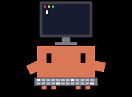

# CYD Claude Buddy

<p align="center">
  
  
  
  
  
</p>
<p align="center"><sub>Clawd hard at work — painting&nbsp;·&nbsp;sweeping&nbsp;·&nbsp;stirring&nbsp;·&nbsp;building&nbsp;·&nbsp;typing</sub></p>

A desk companion for Claude Code: the orange **Clawd** mascot on a **Cheap
Yellow Display** (ESP32) that mirrors your live Claude Code activity and usage
stats — driven entirely by Claude Code **hooks** over **Bluetooth LE**, with
**no WiFi, no network setup, and no always-on PC process** (a tiny bridge is
spawned on demand and exits by itself when Claude goes quiet).

Clawd reacts to what Claude is doing (sleeping / ready / working, plus little
reactions when Claude needs you, finishes, or a session starts) while a stats
card tracks your usage: tokens today and all-time, tool calls, sessions, turns,
and the current session's duration. A tiny Python helper, invoked by Claude Code
hooks, reads each session's transcript and pushes a snapshot to the device.

Built for the **CYD** — the cheapest all-in-one ESP32 + screen + touch board.
The app sits on a thin HAL over `TFT_eSPI`, so it can also be adapted to other
ESP32 + TFT panels if you want — see [Adapting to other
boards](#adapting-to-other-boards).

> The official "Hardware Buddy" Bluetooth feature isn't exposed in the Claude
> desktop app build used here, so this project reproduces the experience over a
> self-hosted transport: a BLE GATT service on the device, an on-demand bridge
> script, and Claude Code hooks on the PC.
>
> _Unofficial, personal fan project — **not affiliated with or endorsed by
> Anthropic.** "Clawd" is Anthropic's character; see [License &
> credits](#license--credits)._

---

## Contents

- [How it works](#how-it-works)
- [What it shows](#what-it-shows)
- [Hardware](#hardware) · [Adapting to other boards](#adapting-to-other-boards)
- [Build &amp; flash](#build--flash)
- [First-time setup](#first-time-setup)
- [Use it from any computer (no repo required)](#use-it-from-any-computer-no-repo-required)
- [On-device controls](#on-device-controls)
- [How usage is counted](#how-usage-is-counted)
- [Power use](#power-use)
- [Troubleshooting](#troubleshooting)
- [Repository layout](#repository-layout) · [License &amp; credits](#license--credits)

## How it works

```
Claude Code (PC) ──hook──▶ buddy_hook.py ──HTTP (localhost)──▶ buddy_bridge.py
  SessionStart / UserPromptSubmit / PreToolUse /                    │ BLE GATT
  PostToolUse / Stop / SessionEnd / Notification                    ▼
                                                            device (Clawd + dashboard)
```

Three pieces; the only radio hop is Bluetooth LE, so there is no network to
configure — the buddy works anywhere your PC is:

- **Device (firmware).** Boots and advertises as `claude-cyd` (NimBLE GATT
  server, peripheral-only). The bridge writes JSON envelopes
  `{"k":"event"|"ask","tok":…,"d":{…}}` to a write characteristic; a second
  characteristic notifies Allow/Deny taps back. It renders the Clawd GIF pack
  from on-board flash (LittleFS) with `AnimatedGIF`. By default it's purely a
  display. (An **optional** opt-in adds on-device *tap-to-approve* for a pending
  tool call — off unless you register the `PermissionRequest` hook; see
  [tools/HOOKS.md](tools/HOOKS.md).)
- **Bridge (`tools/buddy_bridge.py`).** A small Python process that serves the
  hook's HTTP calls on `127.0.0.1:8787` and relays them over BLE. It is **not**
  a daemon: the hook spawns it on demand (connection refused → spawn), it holds
  one BLE connection while events flow, goes radio-quiet if the device is away,
  and **exits by itself after 10 minutes without events**. No autostart entry,
  no standing drain.
- **PC (`tools/buddy_hook.py`).** A single self-contained Python script that
  Claude Code runs on each hook event. It figures out what Claude is doing, reads
  the session transcript for the usage rollup, and `POST`s it to the bridge.
  Stats events are **non-blocking and fail open**: if the bridge or device is
  unreachable the error is swallowed, so they can never slow down or break a
  Claude session. (The optional approval hook briefly waits for your tap and also
  fails open — on a timeout or a disconnected device it falls back to Claude's
  normal prompt.)

The device is the source of truth for its own auth token; the PC just needs the
token (see [setup](#first-time-setup)) — there is no IP, no pairing, no bonding.

## What it shows

**Character states** (the mascot in the middle):

| State | When | Look |
|---|---|---|
| `sleep` (ASLEEP) | offline, or no activity yet | calm, dim |
| `idle` (READY) | connected, no work running | resting |
| `busy` (WORKING) | Claude is working | a rotating set of "working" clips + a whimsical verb ("Pondering…", "Brewing…") that changes in sync with the animation. Tool-aware: editing, running, reading, delegating… |
| `attention` (NEEDS YOU) | the turn was handed back to you — a **Notification**, or **Stop** with nothing to do next | sticky alert; the LED nudge escalates the longer it waits |
| `celebrate` (DONE!) | a turn just finished (**Stop**) | brief celebration |
| `heart` (HELLO) | a new session started (**SessionStart**), or you pet Clawd (tap the character) | brief hello |
| `error` (OOPS) | a tool reported an error | brief wince |
| `dizzy` | triple-tap the screen | easter egg |

`celebrate` / `heart` / `error` are short reactions that play for a few seconds
(and wake the screen if it's off), then fall back to the normal state.
`attention` ("Needs you") is sticky until Claude resumes — or until you dismiss
it on the device. While it waits, the screen drops the stats card for a clean
alert (just the amber Clawd and a **Got it** button); tapping **Got it** drops
the device straight back to idle (LED off) until the next time Claude needs you.
Dismissing is local — it doesn't reply to Claude.

**Stats card** (bottom): two headline figures — **Today** and **Total** tokens —
over four compact counts: **Tools** (tool calls), **Turns** (assistant turns),
**Sess** (sessions today), **Time** (current session duration). The numbers
roll like an odometer when they change. The card has two pages sitting side by
side — **swipe left** and the **Trends card** slides in from the right: a bar
per day for the last 14 days (today in coral, still growing live) with a 7-day
total and daily average — the device keeps a 30-day history in flash, dated by
the PC so it needs no clock of its own. **Swipe right** to slide back; swiping
past the end just rubber-bands. A fuller, live-updating panel is under
long-press → **Settings → Stats** (adds project name, battery estimate, uptime,
free heap, BLE link state).

**Ambient cues.** The onboard RGB LED speaks a colour language — a slow blue
breath while working (cooler/quicker as the session heats up), a gentle amber
breath when it needs you (escalating to hard blinks the longer it waits), red
on error, green when a turn lands, and a little magenta heartbeat while you pet
Clawd — silenced by the **Quiet** (Do Not Disturb) setting, and off whenever
the screen is asleep. Session intensity shows as 1–2 pips in the top bar, next
to a small **battery glyph** (the estimated charge on battery builds).
Set an optional daily token `"budget"` in `buddy.json` and the stats-card
divider becomes a usage gauge (coral → amber near the cap → red over).

## Hardware

**Reference board — ESP32-2432S028R "Cheap Yellow Display" (CYD):**

- ESP32-WROOM-32, 4 MB flash, no PSRAM.
- Display: **ILI9341** 240×320 — the dual-USB "CYD2USB" unit is ILI9341, *not*
  ST7789 (feeding it the ST7789 driver gives a white screen).
- Resistive touch (XPT2046), onboard RGB LED, light sensor (GPIO34), the BOOT
  key doubling as a runtime button, CH340 USB-serial.

It's the cheapest all-in-one board with a screen + touch (≈US$10), which is why
it's the default — but nothing about the app is CYD-specific.

### Power: wired or battery

The board wants **5 V**, over its micro-USB port or the `P1` header's VIN/GND
pins. Two ways to feed it:

- **Wired (simplest).** Any USB power source — a phone charger, a PC port, a
  power strip with USB. Nothing to configure. The top-bar battery glyph and the
  Settings **Battery** row assume the battery setup below; on wall power just
  ignore them.
- **Battery.** Reference setup: a **2000 mAh Li-ion cell + a cheap
  charge/discharge boost module** (the "charge + 5 V boost in one board" kind).
  The cell plugs into the module; the module's 5 V output feeds the CYD (its
  USB-A output into the CYD's micro-USB cable, or OUT+/OUT− wired to `P1`
  VIN/GND). No electrical changes to the CYD itself. Notes from the field:
  - **Charge the module's input port**, not the CYD's USB. Cheap modules'
    USB-C input usually lacks the CC handshake resistors, so a **USB-C PD
    charger with a C-to-C cable delivers nothing** (no LED, no charge) — use a
    USB-A charger / power-bank A-port with an A-to-C (or A-to-micro) cable.
  - **Charge with the buddy powered off** (Settings → Power off) if you want
    the module's "full" LED to be truthful — the running device's draw keeps
    cheap chargers from ever terminating.
  - The firmware ships a **software battery gauge** for exactly this setup:
    the device has no data path to the cell, so it estimates charge from its
    own consumption model (see `docs/battery-gauge-spec.md`). Top-bar glyph
    (amber &lt;20%, red &lt;10%) and a **Battery (est)** row in Settings →
    Stats. It's **fully automatic and death-anchored**: run the device until
    the cell actually dies (the module's protection board guards the cell;
    stats checkpoint every minute near the end), charge it, power it on — the
    gauge learns the cell's real capacity from each death and refills to 100%
    on the first boot after one. Mid-cycle top-ups are invisible to it, so
    the reading runs low until the next full die-charge-boot cycle — it's an
    estimate, treat it as one.

CYD is the target, but the firmware is a thin HAL (`src/hal/`: display, touch,
led, storage) over `TFT_eSPI`, and everything above it — networking, hooks,
stats, the GIF character system — is hardware-independent. To run it on another
ESP32 + TFT:

- **Display:** set the matching `*_DRIVER` flag and pins in `platformio.ini`
  (`TFT_eSPI` supports ILI9341 / ST7789 / ST7735 / ILI9488 / …). The character
  region and UI lay themselves out from `display.width()/height()`.
- **Touch (optional):** adjust the XPT2046 pins in `src/hal/touch.cpp`, or stub
  `hal::Touch` — touch only drives the Settings menu and the easter egg.
- **LED (optional):** `src/hal/led.cpp`; safe to no-op if your board has none.
- **Flash / partition:** the Clawd pack needs ~1.2 MB of LittleFS — size the
  data partition to your board's flash (drop some `busy_*` clips from the pack
  and manifest if you're tight).

The Clawd art is a plain GIF pack (`data/clawd/`, 120 px-wide, black background),
so you can drop in your own character without touching code.

## Build & flash

You need [PlatformIO](https://platformio.org/) (the `pio` CLI, or the VS Code
extension) and a USB cable to the board.

```bash
pio run -e cyd -t upload      # 1) firmware  -> app partition
pio run -e cyd -t uploadfs    # 2) GIF pack  -> LittleFS (data/clawd/)
```

Run both the first time (firmware *and* the filesystem image). After that,
re-flash only what changed — `upload` for code, `uploadfs` for new/edited GIFs.

> **Upgrading from the WiFi/OTA build (mid-2026):** the partition layout went
> back to a single factory app slot, but **nvs and LittleFS keep their exact
> offsets** — so one plain USB `upload` migrates the board with the token,
> touch + battery calibration, stats history and GIF pack all intact (no
> `uploadfs` needed). There is no wireless reflash anymore — updates are
> USB-only, which is the deliberate trade for dropping WiFi.

The display driver is a build flag (`ILI9341_2_DRIVER` in `platformio.ini`); on a
different panel that shows a white or garbled image, switch to your controller's
driver/colour-order flags (e.g. `ST7789_DRIVER` + `TFT_RGB_ORDER=TFT_BGR`).

> **First build on a slow/blocked network.** The initial espressif32 toolchain +
> framework download can stall. If it does, fetch those archives out-of-band
> (e.g. a parallel, resumable downloader) and point PlatformIO at them with
> `platform_packages = …@file://…` in `platformio.ini`.

## First-time setup

1. **Flash** firmware + filesystem (above). The device boots straight to the
   dashboard and starts advertising over BLE — there is nothing to provision.
2. **Read its token:** long-press → **Settings → Stats**. The token is a random
   secret generated on the device.
3. **Install the one PC dependency:** `python -m pip install bleak`
   (the BLE library the bridge uses; everything else is stdlib).
4. **Tell your PC the secret** — `~/.claude/buddy.json`:
   ```json
   { "token": "<device token>" }
   ```
   (Optional: `"port"` to move the bridge off `8787`, `"budget"` for the
   on-device daily token gauge.)
5. **Register the hooks** in `~/.claude/settings.json` so Claude Code drives the
   device. Full snippet + explanation: **[tools/HOOKS.md](tools/HOOKS.md)**.

That's it — start a Claude Code session: the first hook event spawns the
bridge, the bridge finds the buddy, and Clawd wakes up. Your PC needs a
Bluetooth adapter (any laptop has one).

## Use it from any computer (no repo required)

**The flashed device is fully standalone.** Firmware and the animation pack live
in its own flash; it needs no PC, no repo, and no cloud — it just boots and
advertises. The machine with Bluetooth next to it runs the bridge; **other**
computers can drive the buddy *through* that bridge.

On a second machine with its own Bluetooth (e.g. you carry the buddy to another
desk), just repeat the normal setup there: copy `tools/buddy_hook.py` **and**
`tools/buddy_bridge.py` (repo-independent home: `~/.claude/`), `pip install
bleak`, create `buddy.json` with the token, register the hooks.

To drive it from a machine **without** Bluetooth reach (a remote box you SSH
into, a VM), run the bridge on the PC that sits near the buddy with
`python buddy_bridge.py --listen 0.0.0.0`, and on the remote machine point
`buddy.json` at that PC (`"host": "<pc-address>:8787"` — reachable over LAN or
a mesh VPN such as Tailscale). The remote machine only needs `buddy_hook.py`;
the bridge PC is the single ingress.

Requirements: **Python 3 on `PATH`**. `buddy_tokens.json` is created
automatically on first run.

Each machine keeps its **own** counts (`buddy_tokens.json` is per-machine, not
merged); if two machines push at once, the device shows whichever pushed last.

## On-device controls

- **Tap** while asleep — wake the screen.
- **Tap Clawd** — pet the character: a brief `heart` hello.
- **Swipe left / right** — slide the bottom card between **stats** (left page)
  and **trends** (right page); swiping past the end rubber-bands. Returns to
  stats when the screen next sleeps.
- **Tap "Got it"** on the *Needs you* screen — dismiss the nudge: the device
  drops back to idle (LED off) until the next time Claude needs you.
- **Triple-tap** — `dizzy` easter egg.
- **BOOT key** (the physical button next to RST) — short press wakes the screen
  or taps **Got it** for you; holding it toggles **Quiet** (one red blink = on,
  green = off). Handy when tapping the resistive panel is inconvenient.
- **Long-press (~1 s)** — open **Settings**: **Power off** (top row, in red —
  deep sleep: screen, LED and radio off; tap the screen or press the board's
  **RST** button to turn it back on), **Stats** (full live panel),
  **Quiet** (on/off Do Not Disturb — silences the RGB LED and stops the screen
  auto-waking for nudges; only your touch wakes it), **Brightness** (cycle the
  backlight 100 / 70 / 40 % / **auto** — auto night-dims to 25% when the onboard
  light sensor says the room went dark, and eases back up when the lights come
  on), **Recalibrate** (3-point touch calibration; times out safely
  if you walk away), **Close**. Quiet and brightness persist across reboots.
- Auto **screen-off after 30 s** of calm — or **3 min while Claude is working**,
  so long grinds go dark too; a touch, a fresh turn starting, or a nudge wakes
  it. After **an hour** with no touch and no Claude activity at all the device
  deep-sleeps itself (tap to wake).

## How usage is counted

`buddy_hook.py` reads the current session's transcript and rolls up the day:

- **Tokens** = `input + output + cache_creation`. It deliberately **excludes
  `cache_read`** — that's the cached context re-read on *every* turn, which on a
  long session is ~95%+ of the raw token throughput and would balloon "today" to
  absurd numbers without reflecting real use.
- Assistant messages are **de-duplicated by id** (the transcript re-logs a
  message several times as it streams), so tokens / turns / tool-calls aren't
  double-counted.
- The scan is **incremental**: each event resumes from a per-session byte
  offset (kept in `buddy_tokens.json`) and parses only what was appended, so
  hooks stay fast even when a long session's transcript reaches tens of MB.
- **Today** counts persist in `~/.claude/buddy_tokens.json` and reset at local
  midnight; the previous day rolls into the **all-time** total. A session that
  spans midnight isn't double-counted.

## Power use

Ordered by how much they save (all automatic):

- **Auto screen-off.** The backlight is by far the largest draw. 30 s idle when
  calm; **3 min while Claude is working** (so a marathon turn goes dark instead
  of burning the backlight for an hour — the LED events and any fresh turn
  still relight it). While off, the CPU drops 240 → **80 MHz** and the idle
  loop throttles to ~25 Hz; both jump back on wake.
- **Auto deep sleep.** After **1 hour** with no touch *and* no hook events the
  device powers itself fully off — on the battery setup that's ~10 mA
  (including the boost module's idle draw) instead of idling dark.
  Tap the screen to wake. Radio can't wake a deep-sleeping board, which is why
  the leash is a full hour: any Claude activity inside it still lights the
  screen the moment work starts. (While deep asleep it also stops advertising;
  the bridge reconnects on the next scan after you wake it.)
- **BLE instead of WiFi.** The whole reason this build exists: a connected BLE
  peripheral idles far below the old WiFi stack (~90 mA base vs ~143 mA
  measured, before the screen), and advertising while unconnected is cheaper
  still.

For a manual off, **Settings → Power off** deep-sleeps the same way. On
battery the device deliberately runs until the cell's protection cuts power —
that brownout is what calibrates the gauge — checkpointing stats every minute
once the estimate reads ≤3%. Either way a screen tap or the **RST** button
cold-boots straight back into the dashboard.

## Troubleshooting

- **White / garbled screen** — wrong display driver. The CYD2USB unit is
  **ILI9341**, not ST7789; check the `*_DRIVER` flag in `platformio.ini`.
- **Buddy stays asleep / link dot dark** — is a Claude session actually
  running? The bridge only lives while hook events flow (it exits ~10 min after
  the last one) and the buddy naps whenever no bridge is attached. Run any
  Claude turn and watch it wake. To inspect the bridge:
  `curl --noproxy "*" http://127.0.0.1:8787/` (shows `"connected"`).
- **Bridge never connects** — the Windows Bluetooth stack sometimes wedges
  after sleep/resume: toggle Bluetooth off/on (or restart the "Bluetooth
  Support Service"), then run any Claude turn to respawn the bridge. Also check
  `python -m pip show bleak` and that the device is within ~10 m.
- **Numbers never update while connected** — check `buddy.json` (the token
  must match the device's Settings → Stats), that the hooks are registered,
  and that Python 3 is on `PATH`. Events with a wrong token are dropped
  silently by design.
- **Charging does nothing (battery setup)** — don't use a USB-C PD charger
  with a C-to-C cable on a cheap charge module (no CC resistors → no power);
  use a USB-A source. And charge the module's input, not the CYD's USB.
- **Battery reading looks wrong** — normal after mid-cycle top-ups (charging
  is invisible to the gauge). It re-syncs itself on the next full
  die → charge → power-on cycle.

## Repository layout

```
src/            firmware: main.cpp (orchestrator), app/ (state tables, LED
                language, NVS store, power, battery gauge), ui/ (theme, text,
                widgets), screens/ (home, trends, card slide, stats, settings,
                ask), hal/ (display, touch, led, storage), net/ (BLE GATT),
                render/ (Clawd GIF)
data/clawd/     Clawd GIF character pack (flashed as the LittleFS image)
assets/         README preview GIFs
tools/          buddy_hook.py + buddy_bridge.py + HOOKS.md (PC helpers + setup)
docs/           design notes
platformio.ini  build configuration
```

## License & credits

- **Code & tooling** (firmware + `tools/buddy_hook.py`): **MIT** — see
  [LICENSE](LICENSE). © 2026 Qiankang (Kant) Wang.
- **Clawd character art** (`data/clawd/` and `assets/`): **not MIT.** "Clawd" is
  the property of **Anthropic, PBC**; all rights reserved. The pixel sprites are
  adapted from [rullerzhou-afk/clawd-on-desk](https://github.com/rullerzhou-afk/clawd-on-desk)
  (source code AGPL-3.0; artwork all-rights-reserved). Swap in your own
  black-background GIF pack to redistribute the project freely.
- **Concept & event model:** inspired by Anthropic's maker reference
  [claude-desktop-buddy](https://github.com/anthropics/claude-desktop-buddy)
  (MIT), reproduced here over BLE + Claude Code hooks with a self-hosted bridge.
- **CYD pinouts & community:** [witnessmenow/ESP32-Cheap-Yellow-Display](https://github.com/witnessmenow/ESP32-Cheap-Yellow-Display) (MIT).

> **Disclaimer.** This is an unofficial, personal fan project. It is **not
> affiliated with, sponsored by, or endorsed by Anthropic.** "Claude" and
> "Clawd" are trademarks/IP of Anthropic, PBC, used here only to interoperate
> with Claude Code for a non-commercial maker build.
